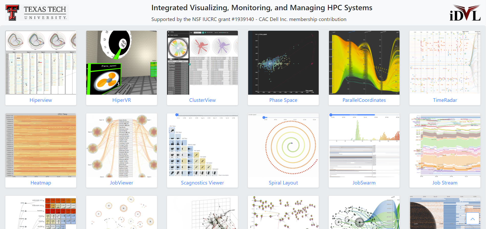
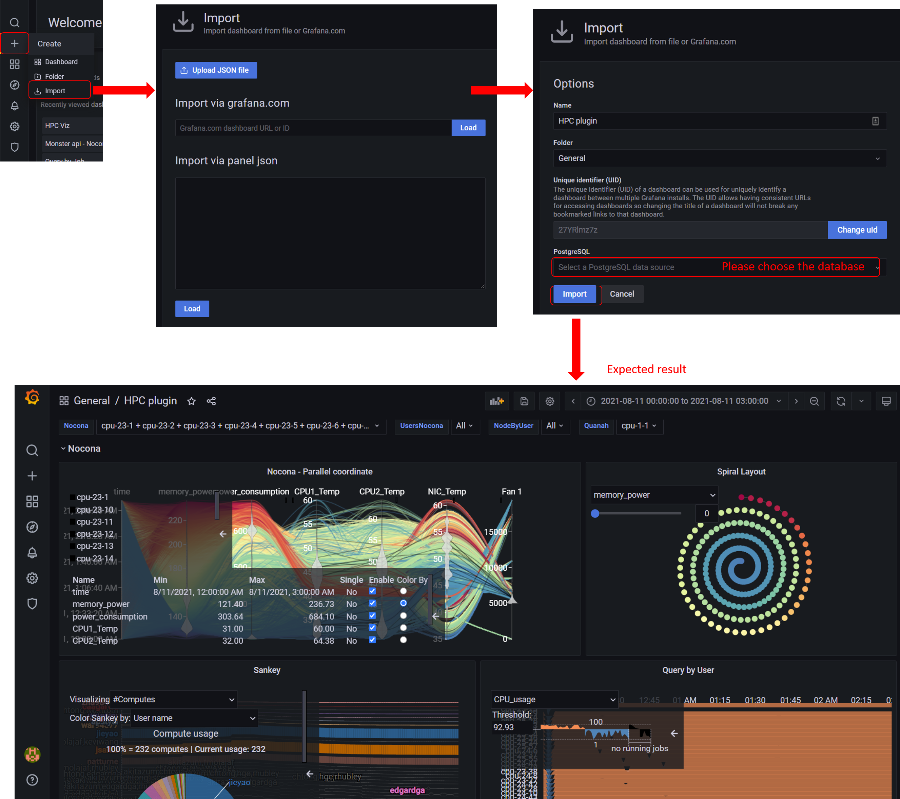
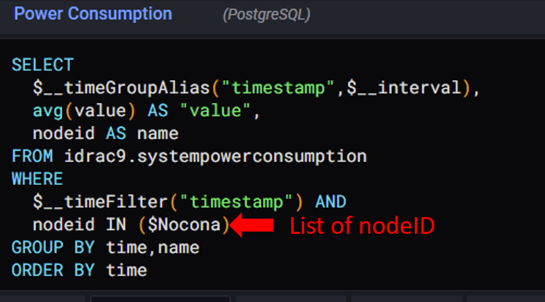
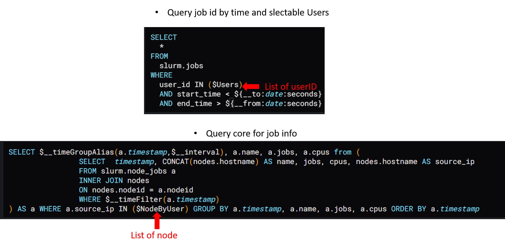
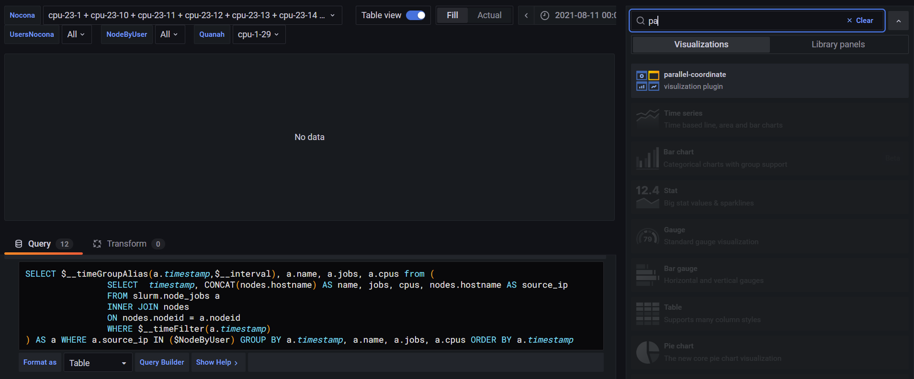

# grafana-plugin #

Grafana plugin is a part of [Integrated Visualizing, Monitoring, and Managing HPC Systems](https://idatavisualizationlab.github.io/HPCC/)


Currently, there are 4 visulization developed as Grafana plugin:
1. [Parallel coordinate](./parallel-coordinate/dist)
2. [Spiral layout](./spiral-layou/dist)
3. [Sankey](./sankey/dist)
4. [Stream-net](./stream-net/dist) (aka. PowerMap)

For introduction about grafana, you can read the [presentation here](https://texastechuniversity-my.sharepoint.com/:p:/g/personal/ngan_v_t_nguyen_ttu_edu/ER3kYNivM4dEtqJCi7UTyfwBbP71Q8XAl89tSkEFzSUCsw?e=fOMuhL)

## Prerequisite ## 
Grafana-plugin require [Grafana v8.0.3](https://grafana.com/grafana/download/8.0.3)

[For Linux](https://grafana.com/grafana/download/8.0.3?platform=linux), [For Windows](https://grafana.com/grafana/download/8.0.3?platform=windows), [For Windown](https://grafana.com/grafana/download/8.0.3?platform=mac), [For Docker](https://grafana.com/grafana/download/8.0.3?platform=docker)
Note that plugins are signed for `http://localhost:5000`. Therefore, please make sure that Grafana will run as port 5000

If you want to run an example dashboard, you need to follow the instruction of [MonSter](https://github.com/nsfcac/MonSter)

## Getting Started ##
Download plugin you want to install 
1. [Parallel coordinate](./parallel-coordinate.zip)
2. [Spiral layout](./spiral-layout.zip)
3. [Sankey](./sankey.zip)
4. [Stream-net](./stream-net.zip)

Unzip plugin(s) at grafana plugin folder

```
unzip my-plugin-0.2.0.zip -d YOUR_PLUGIN_DIR/my-plugin
```

`YOUR_PLUGIN_DIR` can be `C:\Program Files\GrafanaLabs\grafana\data\plugins` in Windows and `/var/lib/grafana/plugins` in Linus. Make sure after unzip the plugin folder will have structure as:
```
|-- plugins
    |-- parallel-coordinate
        |-- dist
    |-- spiral-layout
        |-- dist
    |-- sankey
        |-- dist
    |-- stream-net
        |-- dist        
```

Please restart Grafana after install any plugin

## How to open an example dashboard  ##

Download example dashboard [here](./dashboard/HPC%20Viz-1637011356411.json). Follow the step in following picture


## How to use plugin for existing database ##
While Parallel coordinate and Spiral layout only requires Health metrics, Sanke and Stream-net need job information.

You can add many health metric as you want be copy and modify following query:


Example query for job


To switch the visulization plugin, go to right panel, click on the name of current plugin and search for plugin name


---
Contact for support: Ngan.V.T.Nguyen@ttu.edu
